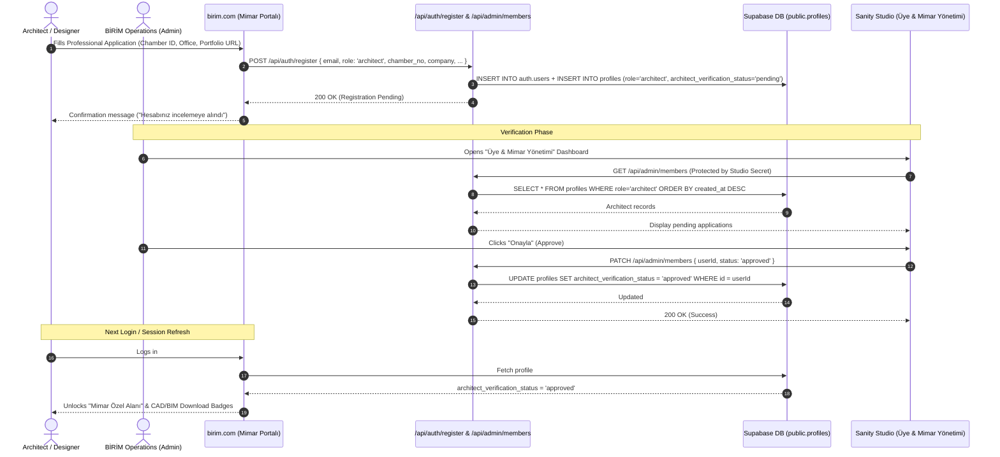
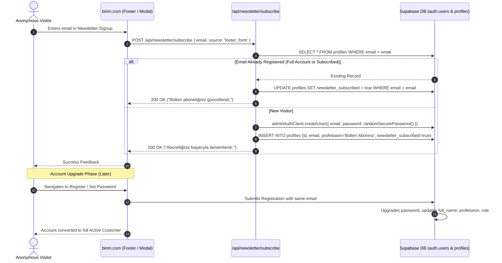
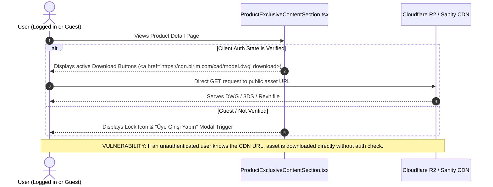
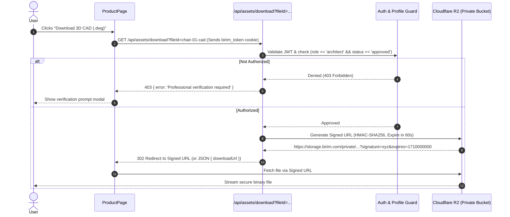
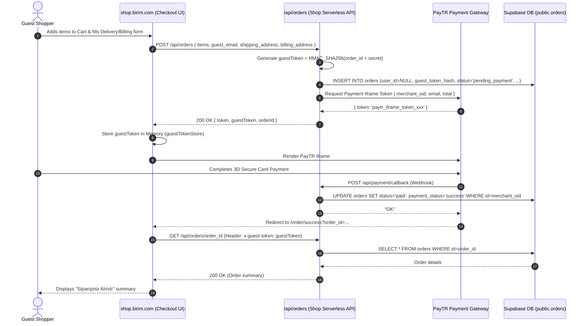
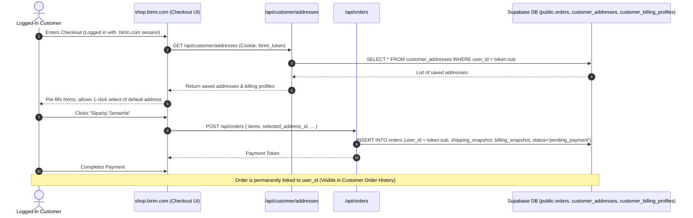
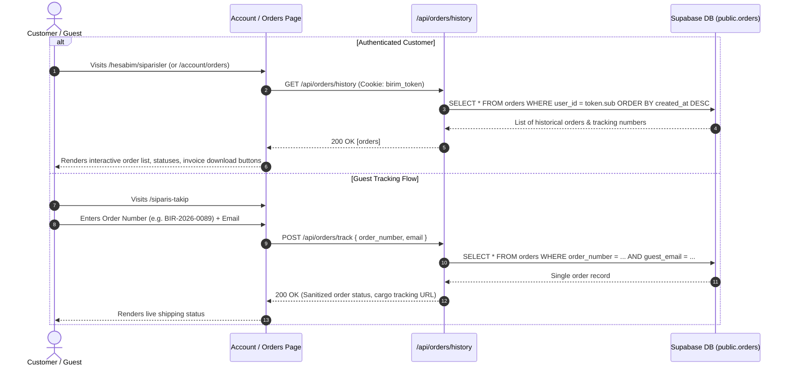
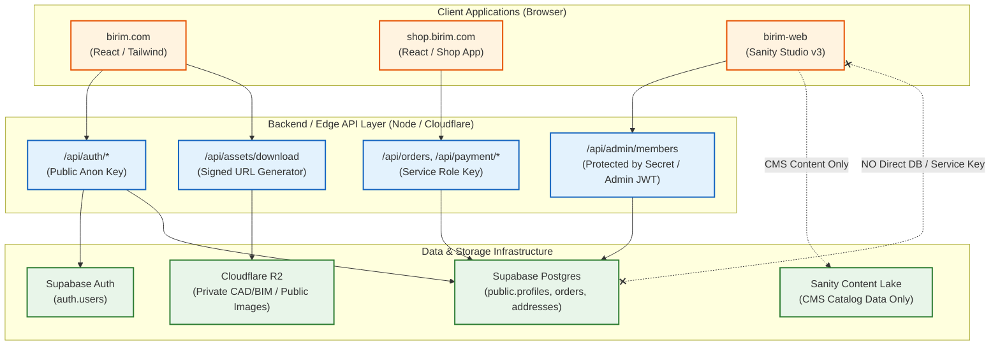

# BİRİM — CUSTOMER IDENTITY DATA FLOW

> **System Scope**: `birim.com` (`my-birim-react`), `shop.birim.com` (`birim-shop`), and `birim-web` (Sanity Studio).  
> **Purpose**: Visual data flows and sequence diagrams illustrating user authentication, professional membership lifecycle, newsletter subscription, protected asset gating, and unified commerce order processing.

---

## 1. Authentication & Session Hydration Flow

```mermaid
sequenceDiagram
    autonumber
    actor User as User (Browser)
    participant Web as birim.com (React Client)
    participant AuthAPI as /api/auth/login (Edge/Node API)
    participant SupaAuth as Supabase Auth (auth.users)
    participant SupaDB as Supabase DB (public.profiles)

    User->>Web: Submits Email & Password
    Web->>AuthAPI: POST /api/auth/login { email, password }
    AuthAPI->>SupaAuth: signInWithPassword(email, password)
    alt Invalid Credentials
        SupaAuth-->>AuthAPI: AuthError (Invalid login credentials)
        AuthAPI-->>Web: 401 Unauthorized { error: 'Invalid credentials' }
        Web-->>User: Display error toast
    else Valid Credentials
        SupaAuth-->>AuthAPI: User Object (UUID, email, metadata)
        AuthAPI->>SupaDB: SELECT * FROM profiles WHERE id = user.id
        SupaDB-->>AuthAPI: Profile row (role, architect_status, full_name, etc.)
        AuthAPI->>AuthAPI: createToken({ sub, email, role, status }) [HMAC-SHA256]
        AuthAPI-->>Web: 200 OK { user, profile }<br/>Set-Cookie: birim_token=...; HttpOnly; SameSite=Lax; Path=/
        Web->>Web: Store user in AuthContext / Zustand State
        Web-->>User: Redirect / Update Header (Profile Avatar, Professional Badge)
    end
```

### Cookie Scope & Cross-Subdomain Behavior

```text
CURRENT IMPLEMENTATION:
Set-Cookie: birim_token=<JWT>; Path=/; HttpOnly; SameSite=Lax; Max-Age=604800
[Result: Host-Only cookie for birim.com — shop.birim.com CANNOT read this cookie]

TARGET IMPLEMENTATION:
Set-Cookie: birim_token=<JWT>; Domain=.birim.com; Path=/; HttpOnly; Secure; SameSite=Lax; Max-Age=604800
[Result: Shared cookie across birim.com, shop.birim.com, api.birim.com]
```

---

## 2. Professional Membership Application & Approval Flow



---

## 3. Newsletter Subscription & Account Upgrade Flow



---

## 4. Protected Asset (CAD / 3D / BIM) Download Flow

### 4.1 Current Flow (Client-Side Check / No Server Gating)



### 4.2 Target Recommended Flow (Server-Gated Signed URLs)



---

## 5. Shop Guest Checkout Flow



---

## 6. Authenticated Checkout Flow (Target Unified Model)



---

## 7. Customer Order History & Tracking Flow



---

## 8. Logout & Session Termination Flow

```mermaid
sequenceDiagram
    autonumber
    actor User as User
    participant Web as birim.com / shop.birim.com
    participant AuthAPI as /api/auth/logout
    participant SupaAuth as Supabase Auth

    User->>Web: Clicks "Çıkış Yap" (Sign Out)
    Web->>AuthAPI: POST /api/auth/logout
    AuthAPI->>SupaAuth: signOut() [Invalidates server refresh token]
    AuthAPI-->>Web: Set-Cookie: birim_token=; Path=/; Domain=.birim.com; Max-Age=0; Expires=Thu, 01 Jan 1970 00:00:00 GMT
    Web->>Web: Clear local AuthContext, cart cache, user state
    Web-->>User: Redirect to Home / Public view (Header resets to "Giriş Yap")
```

---

## 9. Security & Administrative Data Boundary Flow


