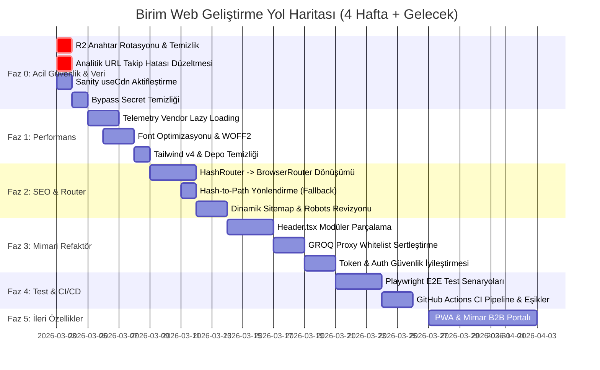

# 🗺️ Birim Web - Detaylı Teknik ve Stratejik Yol Haritası (Roadmap)

**Proje:** Birim Web (React, TypeScript, Vite, Sanity CMS, Cloudflare R2, Vercel)  
**Tarih:** Mart 2026  
**Hedef:** Güvenlik açıklarını kapatmak, ilk yükleme hızını %50 artırmak, SEO indekslenebilirliğini mükemmelleştirmek, kod sürdürülebilirliğini sağlamak ve uçtan uca test otomasyonu kurmak.

---

## 📌 Genel Bakış ve Faz Zaman Çizelgesi



---

## 🚨 FAZ 0: Acil Müdahale, Güvenlik ve Veri Bütünlüğü (Gün 1 - 2)

> [!CAUTION]
> Bu aşamadaki adımlar sistem güvenliği ve analitik veri kaybını durdurmak için bekletilmeden uygulanmalıdır.

### 0.1. Cloudflare R2 API Anahtarlarının Rotasyonu

- [ ] **Cloudflare Dashboard:** R2 sekmesinde eski Access Key ID (`e3e0...`) ve Secret Access Key'i derhal **Revoke** edin.
- [ ] Yeni bir R2 Token oluşturup yetkisini sadece `birim-web` bucket'ı ile sınırlandırın (Object Read & Write).
- [ ] Yeni anahtarları **Vercel Project Settings > Environment Variables** bölümüne (`R2_ACCESS_KEY_ID`, `R2_SECRET_ACCESS_KEY`, `R2_ACCOUNT_ID`) tanımlayın.
- [ ] **Git Geçmişi Temizliği (Opsiyonel ama Tavsiye Edilen):** Reponun kamuya açılma ihtimaline karşı `git-filter-repo` veya `BFG Repo-Cleaner` ile eski commit'lerdeki anahtarları repo geçmişinden purge edin:
  ```bash
  # BFG ile anahtar metinlerini temizleme
  bfg --replace-text banned-secrets.txt
  git reflog expire --expire=now --all && git gc --prune=now --aggressive
  ```

### 0.2. Google Analytics & PostHog URL Takip Hatası Düzeltmesi

- [ ] `ProductDetailPage.tsx`, `NewsDetailPage.tsx`, `DesignerDetailPage.tsx`, `ProjectDetailPageV1/V2/V3.tsx` dosyalarında `window.location.pathname` yerine React Router'dan gelen dinamik path'i kullanın:

  ```typescript
  // Hatalı:
  analytics.pageview(window.location.pathname, seoTitle) // HashRouter'da hep '/' döner!

  // Düzeltme:
  const location = useLocation()
  analytics.pageview(location.pathname, seoTitle)
  ```

### 0.3. Sanity API CDN (`useCdn: true`) Aktifleştirilmesi

- [ ] `src/services/sanity/client.ts` içinde:
  ```typescript
  // Önizleme modunda değilse Sanity Global Edge CDN kullan:
  useCdn: !previewToken,
  ```
  _Kazanım:_ Sanity API yanıt süreleri 250ms'den 20-40ms'ye düşecek, API kota tüketimi %80 azalacak.

### 0.4. Bakım Modu Bypass Anahtarının Güvenli Hale Getirilmesi

- [ ] `src/App.tsx` içindeki `'birim-dev-2025'` hardcoded değerini kaldırın. Sadece `import.meta.env['VITE_MAINTENANCE_BYPASS_SECRET']` tanımlıysa ve eşleşiyorsa izin verin.

---

## ⚡ FAZ 1: Performans, Bundle Boyutu & Kaynak Optimizasyonu (Hafta 1)

> [!TIP]
> Amaç: İlk JavaScript yükleme boyutunu (Initial JS) 500 KB'ın altına çekmek ve LCP (Largest Contentful Paint) değerini < 1.8s seviyesine getirmek.

### 1.1. Telemetry Vendor Lazy Loading (Sentry & PostHog)

- **Durum:** `dist/assets/telemetry-vendor-*.js` şu anda **494 KB** (163 KB gzip) ve ilk açılışta yükleniyor.
- **Uygulama:**
  1. `src/index.tsx` içindeki senkron `errorReporter.init()` ve `initWebVitals()` çağrılarını kaldırın.
  2. Tarayıcı ana iş parçacığı (main thread) boşaldığında yüklemek için dinamik import kullanın:
  ```typescript
  // src/index.tsx
  if (typeof window !== 'undefined') {
    const loadTelemetry = () => {
      import('./lib/telemetryLoader').then(({initTelemetry}) => initTelemetry())
    }
    if ('requestIdleCallback' in window) {
      window.requestIdleCallback(loadTelemetry, {timeout: 3000})
    } else {
      setTimeout(loadTelemetry, 1500)
    }
  }
  ```

### 1.2. Google Fonts ve Tipografi Sadeleştirmesi

- **Durum:** `index.html` içinde 7 font ailesi ve 20+ ağırlık tek link ile isteniyor.
- **Uygulama:**
  - `index.html` linkinden projede kullanılmayan `Barlow Condensed`, `Jura`, `Outfit` fontlarını çıkarın.
  - Sadece ana fontları tutun: `Inter` (300, 400, 600), `Roboto` (300, 400), `Oswald` (300, 400) ve `Michroma` (400).
  - `package.json`'daki ölü bağımlılığı silin:
    ```bash
    npm uninstall @fontsource/zalando-sans-semiexpanded
    ```

### 1.3. Tailwind v4 Geçişinin Tamamlanması ve Dosya Temizliği

- [ ] Kök dizindeki atıl `tailwind.config.js` ve `postcss.config.js` dosyalarını inceleyip v4 direktiflerini tamamen `src/index.css` içine konsolide edin.
- [ ] CSS dosyasında gereksiz `@plugin` veya çift import tanımlarını temizleyin.
- [ ] `size-limit` konfigürasyonunu (`.size-limit.json`) Vite chunk çıktılarına göre güncelleyin.

---

## 🌐 FAZ 2: SEO Mimarisi, Temiz URL'ler & Router Dönüşümü (Hafta 2)

> [!IMPORTANT]
> Modern lüks mobilya markası için `birim.com/#/products` yerine `birim.com/products` URL yapısı kurumsal prestij ve Google SEO sıralamaları için zorunludur.

### 2.1. `HashRouter` → `BrowserRouter` Dönüşümü

- **Vercel Altyapısı:** `vercel.json` içindeki rewrite kuralı zaten tüm yolları `/index.html`'e iletmektedir. Bu sayede `BrowserRouter` sunucu tarafında hazır durumdadır.
- **Uygulama:**
  1. `src/App.tsx` içinde `HashRouter`'ı `BrowserRouter` ile değiştirin:
     ```tsx
     import { BrowserRouter } from 'react-router-dom';
     // ...
     <BrowserRouter future={{ v7_startTransition: true, v7_relativeSplatPath: true }}>
     ```
  2. **Geriye Uyumluluk (Hash-to-Path Redirector):** Sosyal medyada, eski kayıtlarda veya kullanıcı yer imlerinde kalmış `/#/product/xyz` linklerini yakalayıp `/product/xyz` adresine yönlendiren bir Redirect bileşeni ekleyin:
     ```tsx
     // src/components/HashRedirector.tsx
     export function HashRedirector() {
       const navigate = useNavigate()
       useEffect(() => {
         if (window.location.hash.startsWith('#/')) {
           const cleanPath = window.location.hash.replace(/^#/, '')
           navigate(cleanPath, {replace: true})
         }
       }, [navigate])
       return null
     }
     ```

### 2.2. Sitemap ve Robots.txt İyileştirmesi

- [ ] `scripts/generate-sitemap.ts` betiğini güncelleyin:
  - Hash (`#`) içeren tüm ikincil URL'leri sitemap'ten temizleyin.
  - Sanity CMS API'sinden yayınlanmış tüm **ürünleri (`/product/:slug`)**, **tasarımcıları (`/designer/:slug`)**, **haberleri (`/news/:slug`)** ve **projeleri (`/projects/:slug`)** çekerek tam dinamik sitemap oluşturun.
- [ ] `public/robots.txt` dosyasında `Disallow: /api/` ve `Disallow: /profile` kurallarını ekleyip sitemap adresini kesinleştirin.

### 2.3. Dinamik OpenGraph & Twitter Kartları

- [ ] `useSEO.ts` üzerinden paylaşılan sosyal medya linklerinin (`og:url`) hash'siz standart URL formatında üretilmesini sağlayın.

---

## 🏗️ FAZ 3: Kod Kalitesi, Bileşen Refaktörü & Güvenlik Sertleştirmesi (Hafta 3)

### 3.1. `Header.tsx` (1.158 Satır) Bileşeninin Parçalanması

Header dosyasını şu atomik alt bileşenlere ayırarak her birini 150-200 satır aralığına çekin:

1. `src/components/header/HeaderDesktopNav.tsx`: Masaüstü kategori linkleri ve menü etkileşimleri.
2. `src/components/header/HeaderMegaMenu.tsx`: Ürünler hover paneli ve kategori ürün önizlemeleri.
3. `src/components/header/HeaderMobileDrawer.tsx`: Mobil hamburger menü, akordeon kategori listesi.
4. `src/components/header/HeaderSearchModal.tsx`: Arama çubuğu, anlık sonuçlar ve klavye kısayolu (`Ctrl+K` / `Esc`).
5. `src/components/header/HeaderActions.tsx`: Dil seçici, sepet butonu, dark mode toggle ve profil ikonu.

### 3.2. Sanity GROQ Proxy (`api/sanity/query.ts`) Whitelist Mimarisi

- **Sorun:** Mevcut regex kelime engelleme sistemi kırılgan ve atlatılabilir.
- **Çözüm:** GROQ sorgusunu tip seviyesinde denetleyin:

  ```typescript
  // Yalnızca izin verilen doküman tiplerine sorgu atılabilir:
  const ALLOWED_TYPES = [
    'product',
    'category',
    'designer',
    'project',
    'news',
    'page',
    'siteSettings',
  ]

  // Basit sorgu doğrulama:
  if (query.includes('user') || query.includes('verificationToken')) {
    return res.status(403).json({error: 'Erişim engellendi.'})
  }
  ```

### 3.3. Token & Kimlik Doğrulama Güvenliği

- [ ] JWT oturum belirteçleri `HttpOnly; Secure; SameSite=Lax` çerezlerinde tutulduğu için `localStorage.setItem('birim_token', ...)` kullanımını kademeli olarak devre dışı bırakın. XSS durumunda token hırsızlığı riskini sıfıra indirin.
- [ ] `lib/server/token.ts` içindeki `JWT_SECRET` için bağımsız bir secret zorunlu kılın, Sanity Write Token ile çakışmasını engelleyin.

---

## 🧪 FAZ 4: Test Otomasyonu, Uçtan Uca (E2E) & CI/CD Pipeline (Hafta 4)

### 4.1. Playwright E2E Test Senaryolarının Yazılması

`e2e/` klasörü altına aşağıdaki 4 kritik kullanıcı senaryosunu otomatize edin:

- [ ] **Senaryo 1 (Katalog ve Detay):** Ana Sayfa → Ürünler Sayfası → Filtreleme (Koltuk) → Ürün Detayına Giriş → Malzeme sekmesi değişimi.
- [ ] **Senaryo 2 (Sepet & Teklif Akışı):** Ürün Detayında "Sepete Ekle" → CartSidebar açılışı → Miktar artırma → "Teklif İste" butonuna basarak İletişim sayfasına aktarım.
- [ ] **Senaryo 3 (İletişim & Harita):** İletişim Sayfası → Showroom seçimi → Haritayı Aç butonu ve iframe render doğrulaması.
- [ ] **Senaryo 4 (Kullanıcı Oturumu):** Giriş Sayfası → Form validasyon testleri → Hatalı giriş uyarısı → Başarılı giriş simülasyonu.

### 4.2. GitHub Actions CI/CD Pipeline

`.github/workflows/ci.yml` dosyasını oluşturun:

```yaml
name: CI Pipeline

on:
  push:
    branches: [main]
  pull_request:
    branches: [main]

jobs:
  validate:
    runs-on: ubuntu-latest
    steps:
      - uses: actions/checkout@v4
      - uses: actions/setup-node@v4
        with:
          node-version: 20
          cache: 'npm'
      - run: npm ci
      - run: npx tsc --noEmit
      - run: npm run lint
      - run: npx vitest run --coverage
      - run: npm run build
      - name: Playwright E2E
        run: |
          npx playwright install --with-deps
          npm run test:e2e
```

---

## 🚀 FAZ 5: İleri Düzey Özellikler ve Gelecek Vizyonu (Orta & Uzun Vade)

### 5.1. AI Room Planner (Imagen 3) Geliştirmeleri

- [ ] Kullanıcıların kendi odasını yüklemesi sırasında oda tipi algılama (Salon, Ofis, Yatak Odası).
- [ ] Üretilen oda görsellerinin yüksek çözünürlüklü (HD) indirilmesi ve doğrudan teklif sepetine referans görsel olarak eklenebilmesi.
- [ ] Sanity Studio içine "AI Tarafından Üretilen Müşteri Tasarımları" paneli entegrasyonu.

### 5.2. Mimarlar İçin Özel B2B Portalı (Architect Studio)

- [ ] Mimar doğrulaması tamamlanan üyelere özel 3D model (DWG, OBJ, FBX, 3DS) ve yüksek çözünürlüklü kaplama/doku (texture) indirme kütüphanesi.
- [ ] Toplu şartname ve proje teklif listesi oluşturma motoru.

### 5.3. PWA (Progressive Web App) & Çevrimdışı Çalışma

- [ ] `vite-plugin-pwa` konfigürasyonunu tamamlayarak mobil ziyaretçiler için "Uygulamayı Yükle" banner'ı eklenmesi.
- [ ] İnternet kesintilerinde gösterilecek şık, kurumsal bir "Offline Fallback" sayfası.

---

## 📊 Başarı Metrikleri (KPI & Hedefler)

| Metrik                                        |     Mevcut Durum     |          Hedeflenen Durum          |
| :-------------------------------------------- | :------------------: | :--------------------------------: |
| **Lighthouse Performance Skoru**              |         ~72          |              **95+**               |
| **Initial JavaScript Bundle (Gzip)**          |       ~360 KB        |            **< 180 KB**            |
| **Largest Contentful Paint (LCP)**            |         2.8s         |             **< 1.5s**             |
| **Google Dizinlenebilir Sayfa Sayısı**        | Kısıtlı (`#` engeli) | **Tüm Katalog ve Projeler (%100)** |
| **E2E Test Kapsamı**                          |      0 senaryo       |   **4 kritik akış (Playwright)**   |
| **Birim Test Kapsamı (Unit Coverage)**        |         ~45%         |             **> 75%**              |
| **Açık Güvenlik Uyarısı (Security Findings)** |    3 açık / risk     |             **0 Risk**             |
